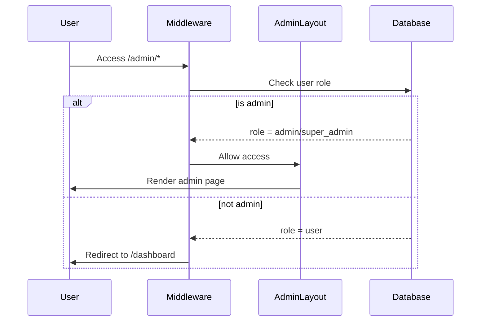

# Design Document: Admin Dashboard

## Overview

The Admin Dashboard is a comprehensive administrative interface for LexiLens platform management. It provides administrators with tools to monitor platform health, manage users, moderate content, and view analytics. The design follows an editorial/magazine aesthetic with bold typography, sophisticated data visualization, and a dark theme that distinguishes it from the main user-facing application.

## Architecture

### High-Level Architecture

```
┌─────────────────────────────────────────────────────────────────┐
│                        Admin Dashboard                          │
├─────────────────────────────────────────────────────────────────┤
│  ┌─────────────┐  ┌─────────────┐  ┌─────────────┐             │
│  │  Overview   │  │    Users    │  │  Content    │             │
│  │  Analytics  │  │  Management │  │ Moderation  │             │
│  └─────────────┘  └─────────────┘  └─────────────┘             │
│  ┌─────────────┐  ┌─────────────┐                              │
│  │  Activity   │  │   System    │                              │
│  │    Logs     │  │   Health    │                              │
│  └─────────────┘  └─────────────┘                              │
├─────────────────────────────────────────────────────────────────┤
│                     Admin API Routes                            │
│  /api/admin/stats  /api/admin/users  /api/admin/content        │
│  /api/admin/logs   /api/admin/health                           │
├─────────────────────────────────────────────────────────────────┤
│                    Server Actions Layer                         │
│  lib/actions/admin/*                                           │
├─────────────────────────────────────────────────────────────────┤
│                      Database Layer                             │
│  users, saved_analyses, daily_usage, admin_logs                │
└─────────────────────────────────────────────────────────────────┘
```

### Route Structure

```
app/
├── (admin)/                      # Admin route group
│   ├── layout.tsx                # Admin layout with sidebar
│   ├── admin/
│   │   ├── page.tsx              # Overview/Analytics dashboard
│   │   ├── users/
│   │   │   ├── page.tsx          # User list
│   │   │   └── [id]/page.tsx     # User detail
│   │   ├── content/
│   │   │   └── page.tsx          # Content moderation
│   │   ├── logs/
│   │   │   └── page.tsx          # Activity logs
│   │   └── health/
│   │       └── page.tsx          # System health
```

### Authentication Flow



## Components and Interfaces

### Admin Layout Component

```typescript
interface AdminLayoutProps {
  children: React.ReactNode;
}

interface AdminNavItem {
  label: string;
  href: string;
  icon: React.ComponentType;
  badge?: number;
}
```

### Analytics Components

```typescript
interface MetricCardProps {
  title: string;
  value: number | string;
  change?: number;        // Percentage change from previous period
  changeLabel?: string;
  icon: React.ComponentType;
  trend?: 'up' | 'down' | 'neutral';
}

interface TimeSeriesChartProps {
  data: Array<{
    date: string;
    value: number;
  }>;
  title: string;
  color?: string;
  height?: number;
}

interface PlatformStatsResponse {
  totalUsers: number;
  totalAnalyses: number;
  dailyActiveUsers: number;
  totalWordsLearned: number;
  userGrowth: Array<{ date: string; count: number }>;
  analysisGrowth: Array<{ date: string; count: number }>;
}
```

### User Management Components

```typescript
interface AdminUserListProps {
  users: AdminUser[];
  pagination: PaginationInfo;
  onSearch: (query: string) => void;
  onSort: (field: SortField, direction: SortDirection) => void;
  onUserClick: (userId: string) => void;
}

interface AdminUser {
  id: string;
  email: string;
  name: string | null;
  status: 'active' | 'suspended';
  role: 'user' | 'admin' | 'super_admin';
  createdAt: Date;
  lastActivityAt: Date | null;
  totalAnalyses: number;
  totalWordsLearned: number;
}

interface UserDetailProps {
  user: AdminUser;
  recentAnalyses: SavedAnalysis[];
  onSuspend: () => void;
  onReactivate: () => void;
}

type SortField = 'createdAt' | 'lastActivityAt' | 'totalAnalyses';
type SortDirection = 'asc' | 'desc';
```

### Content Moderation Components

```typescript
interface ContentModerationProps {
  analyses: ModeratableAnalysis[];
  pagination: PaginationInfo;
  onFlag: (analysisId: string, reason: string) => void;
  onDelete: (analysisId: string) => void;
  onDateRangeChange: (start: Date, end: Date) => void;
}

interface ModeratableAnalysis {
  id: string;
  userId: string;
  userEmail: string;
  imageUrl: string;
  description: string;
  createdAt: Date;
  flagged: boolean;
  flagReason?: string;
}
```

### Activity Log Components

```typescript
interface ActivityLogProps {
  logs: AdminActivityLog[];
  pagination: PaginationInfo;
  onFilterChange: (filters: LogFilters) => void;
}

interface AdminActivityLog {
  id: string;
  adminId: string;
  adminEmail: string;
  action: AdminAction;
  targetType: 'user' | 'content' | 'system';
  targetId: string;
  details: Record<string, unknown>;
  createdAt: Date;
}

type AdminAction = 
  | 'user_suspended'
  | 'user_reactivated'
  | 'content_flagged'
  | 'content_deleted'
  | 'role_changed';

interface LogFilters {
  actionType?: AdminAction;
  dateFrom?: Date;
  dateTo?: Date;
}
```

### System Health Components

```typescript
interface SystemHealthProps {
  metrics: SystemMetrics;
}

interface SystemMetrics {
  apiResponseTime: {
    average: number;
    p95: number;
    p99: number;
  };
  storageUsage: {
    used: number;
    total: number;
    percentage: number;
  };
  dailyApiCalls: number;
  errorRate: number;
}

interface HealthIndicatorProps {
  label: string;
  value: number;
  unit: string;
  threshold: {
    warning: number;
    critical: number;
  };
}
```

## Data Models

### Database Schema Extensions

```sql
-- Add role column to users table
ALTER TABLE users ADD COLUMN role TEXT DEFAULT 'user' NOT NULL;
-- Values: 'user', 'admin', 'super_admin'

-- Add status column to users table
ALTER TABLE users ADD COLUMN status TEXT DEFAULT 'active' NOT NULL;
-- Values: 'active', 'suspended'

-- Add flagged columns to saved_analyses
ALTER TABLE saved_analyses ADD COLUMN flagged BOOLEAN DEFAULT FALSE;
ALTER TABLE saved_analyses ADD COLUMN flag_reason TEXT;
ALTER TABLE saved_analyses ADD COLUMN flagged_at TIMESTAMP;
ALTER TABLE saved_analyses ADD COLUMN flagged_by UUID REFERENCES users(id);

-- Admin activity logs table
CREATE TABLE admin_logs (
  id UUID PRIMARY KEY DEFAULT gen_random_uuid(),
  admin_id UUID NOT NULL REFERENCES users(id),
  action TEXT NOT NULL,
  target_type TEXT NOT NULL,
  target_id TEXT NOT NULL,
  details JSONB,
  created_at TIMESTAMP DEFAULT NOW() NOT NULL
);

-- System metrics table (for historical tracking)
CREATE TABLE system_metrics (
  id UUID PRIMARY KEY DEFAULT gen_random_uuid(),
  metric_type TEXT NOT NULL,
  value NUMERIC NOT NULL,
  recorded_at TIMESTAMP DEFAULT NOW() NOT NULL
);
```

### Drizzle Schema Additions

```typescript
// Add to lib/db/schema.ts

export const adminLogs = pgTable('admin_logs', {
  id: uuid('id').primaryKey().defaultRandom(),
  adminId: uuid('admin_id').notNull().references(() => users.id),
  action: text('action').notNull(),
  targetType: text('target_type').notNull(),
  targetId: text('target_id').notNull(),
  details: jsonb('details'),
  createdAt: timestamp('created_at').defaultNow().notNull(),
});

export const systemMetrics = pgTable('system_metrics', {
  id: uuid('id').primaryKey().defaultRandom(),
  metricType: text('metric_type').notNull(),
  value: integer('value').notNull(),
  recordedAt: timestamp('recorded_at').defaultNow().notNull(),
});

// Update users table type
export interface User {
  // ... existing fields
  role: 'user' | 'admin' | 'super_admin';
  status: 'active' | 'suspended';
}
```

## API Design

### Admin API Routes

| Method | Endpoint | Description |
|--------|----------|-------------|
| GET | /api/admin/stats | Get platform analytics |
| GET | /api/admin/users | List users with pagination |
| GET | /api/admin/users/[id] | Get user details |
| PATCH | /api/admin/users/[id] | Update user (suspend/reactivate) |
| GET | /api/admin/content | List analyses for moderation |
| PATCH | /api/admin/content/[id] | Flag/unflag content |
| DELETE | /api/admin/content/[id] | Delete content |
| GET | /api/admin/logs | Get activity logs |
| GET | /api/admin/health | Get system health metrics |

### Server Actions

```
lib/actions/admin/
├── get-platform-stats.ts
├── get-admin-users.ts
├── get-user-detail.ts
├── update-user-status.ts
├── get-moderation-content.ts
├── flag-content.ts
├── delete-content.ts
├── get-activity-logs.ts
├── create-activity-log.ts
└── get-system-health.ts
```


## Correctness Properties

*A property is a characteristic or behavior that should hold true across all valid executions of a system—essentially, a formal statement about what the system should do. Properties serve as the bridge between human-readable specifications and machine-verifiable correctness guarantees.*

### Property 1: Role-Based Access Control

*For any* user attempting to access admin routes, access SHALL be granted if and only if the user's role is 'admin' or 'super_admin'. Non-admin users SHALL always be redirected.

**Validates: Requirements 1.1, 1.2**

### Property 2: Platform Stats Aggregation Accuracy

*For any* set of users and analyses in the database, the platform stats endpoint SHALL return counts that exactly match the actual record counts (total users = COUNT(users), total analyses = COUNT(saved_analyses), total words = SUM(user_stats.total_words_learned)).

**Validates: Requirements 2.1, 2.2, 2.4**

### Property 3: Time-Series Date Grouping

*For any* collection of records with timestamps, the time-series aggregation SHALL group records by date such that each date bucket contains exactly the records created on that date, and the sum of all bucket counts equals the total record count.

**Validates: Requirements 2.5, 2.6**

### Property 4: User Pagination Correctness

*For any* page number and page size, the paginated user list SHALL return at most pageSize users, and iterating through all pages SHALL yield exactly the total user count without duplicates or omissions.

**Validates: Requirements 3.1**

### Property 5: User Search Filtering

*For any* search query string, the filtered user list SHALL contain only users whose email OR name contains the query string (case-insensitive), and SHALL contain all such matching users.

**Validates: Requirements 3.3**

### Property 6: User Suspend/Reactivate Round-Trip

*For any* active user, suspending then reactivating the user SHALL restore the user to 'active' status with all other user data unchanged.

**Validates: Requirements 3.5, 3.6**

### Property 7: User List Sorting

*For any* sort field and direction, the returned user list SHALL be ordered such that for any two adjacent users, the first user's sort field value is less than or equal to (for ascending) or greater than or equal to (for descending) the second user's value.

**Validates: Requirements 3.7**

### Property 8: Content Date Range Filtering

*For any* date range [start, end], the filtered content list SHALL contain only analyses with createdAt >= start AND createdAt <= end, and SHALL contain all such analyses.

**Validates: Requirements 4.2**

### Property 9: Content Deletion Removes Record

*For any* analysis that is deleted, querying for that analysis by ID SHALL return not found, and the analysis SHALL not appear in any list queries.

**Validates: Requirements 4.4**

### Property 10: Admin Actions Create Activity Logs

*For any* admin action (suspend, reactivate, flag, delete), executing the action SHALL create exactly one activity log entry with the correct action type, target, and admin ID.

**Validates: Requirements 5.2, 5.3**

### Property 11: Activity Log Filtering

*For any* combination of action type filter and date range filter, the filtered log list SHALL contain only entries matching ALL specified filters, and SHALL contain all such matching entries.

**Validates: Requirements 5.4**

### Property 12: Health Metric Threshold Warnings

*For any* metric value and threshold configuration, the metric SHALL be flagged as warning if and only if the value exceeds the warning threshold.

**Validates: Requirements 6.4**

## Error Handling

### Authentication Errors

| Error | HTTP Status | Response |
|-------|-------------|----------|
| Not authenticated | 401 | `{ error: 'Unauthorized', message: 'Please log in' }` |
| Not admin | 403 | `{ error: 'Forbidden', message: 'Admin access required' }` |
| Session expired | 401 | `{ error: 'Unauthorized', message: 'Session expired' }` |

### Validation Errors

| Error | HTTP Status | Response |
|-------|-------------|----------|
| Invalid user ID | 400 | `{ error: 'Bad Request', message: 'Invalid user ID format' }` |
| Invalid date range | 400 | `{ error: 'Bad Request', message: 'End date must be after start date' }` |
| Invalid page number | 400 | `{ error: 'Bad Request', message: 'Page must be positive integer' }` |

### Resource Errors

| Error | HTTP Status | Response |
|-------|-------------|----------|
| User not found | 404 | `{ error: 'Not Found', message: 'User not found' }` |
| Analysis not found | 404 | `{ error: 'Not Found', message: 'Analysis not found' }` |
| Cannot suspend self | 400 | `{ error: 'Bad Request', message: 'Cannot suspend your own account' }` |

### Server Errors

| Error | HTTP Status | Response |
|-------|-------------|----------|
| Database error | 500 | `{ error: 'Internal Server Error', message: 'Database operation failed' }` |
| External service error | 502 | `{ error: 'Bad Gateway', message: 'External service unavailable' }` |

## Testing Strategy

### Dual Testing Approach

This feature requires both unit tests and property-based tests for comprehensive coverage:

- **Unit tests**: Verify specific examples, edge cases, and error conditions
- **Property tests**: Verify universal properties across all valid inputs

### Property-Based Testing Configuration

- **Library**: fast-check (TypeScript property-based testing library)
- **Minimum iterations**: 100 per property test
- **Tag format**: `Feature: admin-dashboard, Property {number}: {property_text}`

### Test Categories

#### Unit Tests

1. **Authentication middleware tests**
   - Test admin role detection
   - Test redirect behavior for non-admins
   - Test session validation

2. **API route tests**
   - Test each endpoint with valid inputs
   - Test error responses for invalid inputs
   - Test authorization checks

3. **Server action tests**
   - Test database operations
   - Test input validation with Valibot
   - Test error handling

4. **Component tests**
   - Test metric card rendering
   - Test chart data formatting
   - Test pagination controls

#### Property-Based Tests

Each correctness property will be implemented as a property-based test:

1. **Property 1**: Generate random users with random roles, verify access decisions
2. **Property 2**: Generate random user/analysis datasets, verify count accuracy
3. **Property 3**: Generate random timestamped records, verify date grouping
4. **Property 4**: Generate random page sizes and user counts, verify pagination
5. **Property 5**: Generate random search queries and user data, verify filtering
6. **Property 6**: Generate random users, apply suspend/reactivate, verify round-trip
7. **Property 7**: Generate random user data, verify sort ordering
8. **Property 8**: Generate random date ranges and analyses, verify filtering
9. **Property 9**: Generate random analyses, delete, verify removal
10. **Property 10**: Generate random admin actions, verify log creation
11. **Property 11**: Generate random filters and log entries, verify filtering
12. **Property 12**: Generate random metric values and thresholds, verify warnings

### Test File Structure

```
__tests__/
├── admin/
│   ├── auth.test.ts              # Authentication unit tests
│   ├── stats.test.ts             # Stats endpoint unit tests
│   ├── users.test.ts             # User management unit tests
│   ├── content.test.ts           # Content moderation unit tests
│   ├── logs.test.ts              # Activity log unit tests
│   └── properties/
│       ├── access-control.property.ts
│       ├── stats-aggregation.property.ts
│       ├── pagination.property.ts
│       ├── filtering.property.ts
│       └── round-trip.property.ts
```

## UI Design Specification

### Design Philosophy: Editorial Magazine Aesthetic

The admin dashboard adopts a sophisticated editorial/magazine aesthetic that distinguishes it from the main user-facing application. This creates a premium, professional feel appropriate for administrative tasks.

### Typography

- **Display Font**: "Playfair Display" - Elegant serif for headings and key metrics
- **Body Font**: "Inter" - Clean sans-serif for data and UI elements
- **Monospace**: "JetBrains Mono" - For IDs, timestamps, and technical data

### Color Palette

```css
:root {
  /* Dark theme base */
  --admin-bg: #0a0a0b;
  --admin-surface: #141416;
  --admin-surface-elevated: #1c1c1f;
  --admin-border: #2a2a2e;
  
  /* Text */
  --admin-text-primary: #fafafa;
  --admin-text-secondary: #a1a1aa;
  --admin-text-muted: #71717a;
  
  /* Accent colors for data visualization */
  --admin-accent-blue: #3b82f6;
  --admin-accent-emerald: #10b981;
  --admin-accent-amber: #f59e0b;
  --admin-accent-rose: #f43f5e;
  --admin-accent-violet: #8b5cf6;
  
  /* Status colors */
  --admin-success: #22c55e;
  --admin-warning: #eab308;
  --admin-error: #ef4444;
}
```

### Component Styling

#### Metric Cards

```css
.metric-card {
  background: linear-gradient(135deg, var(--admin-surface) 0%, var(--admin-surface-elevated) 100%);
  border: 1px solid var(--admin-border);
  border-radius: 16px;
  padding: 24px;
  box-shadow: 0 4px 24px rgba(0, 0, 0, 0.3);
}

.metric-value {
  font-family: 'Playfair Display', serif;
  font-size: 48px;
  font-weight: 700;
  background: linear-gradient(135deg, #fff 0%, #a1a1aa 100%);
  -webkit-background-clip: text;
  -webkit-text-fill-color: transparent;
}
```

#### Data Tables

```css
.admin-table {
  background: var(--admin-surface);
  border-radius: 12px;
  overflow: hidden;
}

.admin-table th {
  font-family: 'Inter', sans-serif;
  font-size: 11px;
  font-weight: 600;
  text-transform: uppercase;
  letter-spacing: 0.05em;
  color: var(--admin-text-muted);
  padding: 16px;
  border-bottom: 1px solid var(--admin-border);
}

.admin-table td {
  padding: 16px;
  border-bottom: 1px solid var(--admin-border);
}

.admin-table tr:hover {
  background: var(--admin-surface-elevated);
}
```

### Animations

- **Page transitions**: Fade in with subtle upward slide (200ms ease-out)
- **Card hover**: Scale 1.02 with enhanced shadow (150ms ease)
- **Data loading**: Skeleton pulse animation
- **Chart rendering**: Staggered line draw animation
- **Number counters**: Count-up animation on initial load

### Responsive Breakpoints

- **Desktop**: 1280px+ (full sidebar, 4-column metric grid)
- **Tablet**: 768px-1279px (collapsible sidebar, 2-column grid)
- **Mobile**: <768px (bottom navigation, single column)
