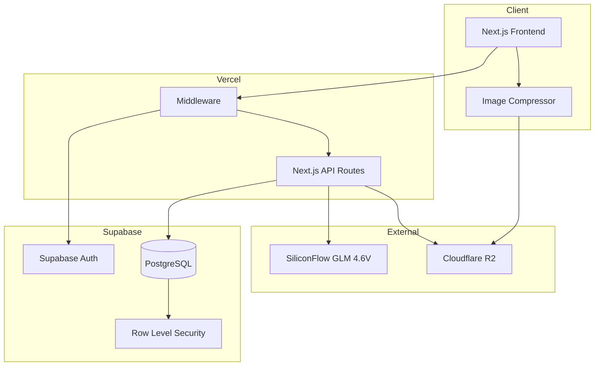

# Design Document

## Overview

This document describes the technical design for an image-based language learning platform built with Next.js, Supabase, and SiliconFlow AI. The platform enables users to upload images, receive AI-generated descriptions in their target language, and extract vocabulary for language learning.

The architecture follows a modern serverless approach with Next.js API routes handling backend logic, Supabase providing authentication and database services, Cloudflare R2 for image storage, and SiliconFlow GLM 4.6V for AI-powered image analysis.

## Architecture



### Request Flow

1. User interacts with Next.js frontend
2. Middleware validates session via Supabase Auth
3. Protected API routes process requests
4. Database operations go through Supabase with RLS
5. Images are compressed client-side and uploaded to R2
6. AI analysis requests go to SiliconFlow API

## Components and Interfaces

### Frontend Components

```typescript
// Page Components
interface PageComponent {
  LandingPage: React.FC;
  LoginPage: React.FC;
  RegisterPage: React.FC;
  DashboardPage: React.FC;
  AnalyzePage: React.FC;
  SavedPage: React.FC;
  SettingsPage: React.FC;
  ProfilePage: React.FC;
}

// Feature Components
interface FeatureComponent {
  ImageUploader: React.FC<ImageUploaderProps>;
  AnalysisResult: React.FC<AnalysisResultProps>;
  VocabularyList: React.FC<VocabularyListProps>;
  VocabularyCard: React.FC<VocabularyCardProps>;
  UsageCounter: React.FC<UsageCounterProps>;
  LanguageSelector: React.FC<LanguageSelectorProps>;
  StatsCard: React.FC<StatsCardProps>;
  AchievementBadge: React.FC<AchievementBadgeProps>;
}
```

### API Route Handlers

```typescript
// Authentication (handled by Supabase Client)
// - signUp, signIn, signOut, resetPassword, OAuth

// User Settings API
interface UserSettingsAPI {
  GET: '/api/user/settings' => UserSettings;
  PUT: '/api/user/settings' => UserSettings;
  PUT: '/api/user/language-preferences' => LanguagePreferences;
}

// Image Analysis API
interface AnalysisAPI {
  POST: '/api/analyze/image' => AnalysisResult;
  GET: '/api/analyze/usage' => UsageInfo;
}

// Saved Results API
interface SavedAPI {
  GET: '/api/saved' => SavedAnalysis[];
  GET: '/api/saved/:id' => SavedAnalysis;
  POST: '/api/saved' => SavedAnalysis;
  DELETE: '/api/saved/:id' => void;
  GET: '/api/saved/search?q=' => SavedAnalysis[];
  GET: '/api/saved/export?format=' => Blob;
}

// Statistics API
interface StatsAPI {
  GET: '/api/stats' => UserStats;
  GET: '/api/stats/achievements' => Achievement[];
}
```

### Service Layer

```typescript
// Image Service
interface ImageService {
  compressImage(file: File, maxSizeKB: number): Promise<Blob>;
  uploadToR2(blob: Blob, userId: string): Promise<string>;
  validateImageType(file: File): boolean;
  deleteFromR2(imageUrl: string): Promise<void>;
}

// AI Analysis Service
interface AIAnalysisService {
  analyzeImage(
    imageUrl: string,
    learningLanguage: string,
    motherLanguage: string,
    proficiencyLevel: string
  ): Promise<AnalysisResult>;
}

// Usage Service
interface UsageService {
  checkDailyLimit(userId: string): Promise<UsageInfo>;
  incrementUsage(userId: string): Promise<void>;
  resetDailyUsage(): Promise<void>; // Cron job
}

// Stats Service
interface StatsService {
  updateWordCount(userId: string, newWords: number): Promise<void>;
  updateStreak(userId: string): Promise<void>;
  checkAchievements(userId: string): Promise<Achievement[]>;
}
```

## Data Models

### Database Schema (Drizzle ORM)

```typescript
// users table
interface User {
  id: string;           // UUID, primary key (from Supabase Auth)
  email: string;        // unique
  name: string | null;
  motherLanguage: string;
  learningLanguage: string;
  proficiencyLevel: 'beginner' | 'intermediate' | 'advanced';
  createdAt: Date;
  updatedAt: Date;
}

// daily_usage table
interface DailyUsage {
  id: string;           // UUID, primary key
  userId: string;       // foreign key -> users
  date: Date;           // DATE type
  usageCount: number;   // default 0, max 5 for free users
  // UNIQUE constraint on (userId, date)
}

// saved_analyses table
interface SavedAnalysis {
  id: string;           // UUID, primary key
  userId: string;       // foreign key -> users
  imageUrl: string;
  description: string;
  vocabulary: VocabularyItem[];  // JSONB
  createdAt: Date;
}

// user_stats table
interface UserStats {
  id: string;           // UUID, primary key
  userId: string;       // foreign key -> users, unique
  totalWordsLearned: number;
  currentStreak: number;
  longestStreak: number;
  lastActivityDate: Date | null;
  updatedAt: Date;
}

// achievements table
interface Achievement {
  id: string;           // UUID, primary key
  userId: string;       // foreign key -> users
  type: string;         // e.g., 'words_10', 'streak_7'
  earnedAt: Date;
}
```

### Application Types

```typescript
interface VocabularyItem {
  word: string;
  translation: string;
  pronunciation: string;
  exampleSentence: string;
  category: string;     // e.g., 'noun', 'verb', 'adjective'
}

interface AnalysisResult {
  description: string;
  vocabulary: VocabularyItem[];
  imageUrl: string;
  analyzedAt: Date;
}

interface UsageInfo {
  used: number;
  limit: number;
  remaining: number;
  resetsAt: Date;       // Next 00:00 UTC
}

interface LanguagePreferences {
  motherLanguage: string;
  learningLanguage: string;
  proficiencyLevel: 'beginner' | 'intermediate' | 'advanced';
}

interface UserSettings extends LanguagePreferences {
  name: string;
  email: string;
  theme: 'light' | 'dark' | 'system';
}
```

### Zod Validation Schemas

```typescript
import { z } from 'zod';

const languageSchema = z.enum([
  'en', 'zh', 'es', 'fr', 'ja', 'ko', 'de', 'it', 'pt', 'ru',
  'ar', 'hi', 'th', 'vi', 'id', 'tr', 'pl', 'nl', 'sv', 'da'
]);

const proficiencySchema = z.enum(['beginner', 'intermediate', 'advanced']);

const languagePreferencesSchema = z.object({
  motherLanguage: languageSchema,
  learningLanguage: languageSchema,
  proficiencyLevel: proficiencySchema,
});

const vocabularyItemSchema = z.object({
  word: z.string().min(1),
  translation: z.string().min(1),
  pronunciation: z.string(),
  exampleSentence: z.string(),
  category: z.string(),
});

const analysisResultSchema = z.object({
  description: z.string().min(1),
  vocabulary: z.array(vocabularyItemSchema).min(1),
  imageUrl: z.string().url(),
  analyzedAt: z.date(),
});

const saveAnalysisRequestSchema = z.object({
  imageUrl: z.string().url(),
  description: z.string().min(1),
  vocabulary: z.array(vocabularyItemSchema).min(1),
});
```

## Error Handling

### Error Types

```typescript
class AppError extends Error {
  constructor(
    message: string,
    public code: string,
    public statusCode: number,
    public isOperational: boolean = true
  ) {
    super(message);
  }
}

// Specific error classes
class AuthenticationError extends AppError {
  constructor(message = 'Authentication required') {
    super(message, 'AUTH_ERROR', 401);
  }
}

class AuthorizationError extends AppError {
  constructor(message = 'Access denied') {
    super(message, 'FORBIDDEN', 403);
  }
}

class ValidationError extends AppError {
  constructor(message: string, public errors: ZodError) {
    super(message, 'VALIDATION_ERROR', 400);
  }
}

class RateLimitError extends AppError {
  constructor(message = 'Daily limit exceeded') {
    super(message, 'RATE_LIMIT', 429);
  }
}

class AIServiceError extends AppError {
  constructor(message = 'AI service unavailable') {
    super(message, 'AI_ERROR', 503);
  }
}

class ImageProcessingError extends AppError {
  constructor(message: string) {
    super(message, 'IMAGE_ERROR', 400);
  }
}
```

### Error Handling Strategy

1. **API Routes**: Wrap handlers in try-catch, return consistent error responses
2. **Client**: Use React Query's error handling with toast notifications
3. **Validation**: Zod schemas validate all inputs at API boundaries
4. **AI Service**: Implement retry logic with exponential backoff (max 3 retries)
5. **Image Upload**: Validate file type and size before upload, handle R2 errors

### Error Response Format

```typescript
interface ErrorResponse {
  error: {
    code: string;
    message: string;
    details?: unknown;
  };
}
```

## Correctness Properties

*A property is a characteristic or behavior that should hold true across all valid executions of a system—essentially, a formal statement about what the system should do. Properties serve as the bridge between human-readable specifications and machine-verifiable correctness guarantees.*

### Property 1: Registration creates user record
*For any* valid registration data (email, password), submitting registration should result in a user record being created in the database with the provided email.
**Validates: Requirements 1.1**

### Property 2: Duplicate email registration fails
*For any* email that already exists in the database, attempting to register with that email should return an error and not create a duplicate record.
**Validates: Requirements 1.2**

### Property 3: Valid credentials authenticate successfully
*For any* user with valid credentials (correct email and password), the authentication function should return a valid session.
**Validates: Requirements 1.4**

### Property 4: Invalid credentials return generic error
*For any* invalid login attempt (wrong email or wrong password), the error message should be identical and not reveal which field was incorrect.
**Validates: Requirements 1.5**

### Property 5: Language preferences round-trip
*For any* valid language preference (motherLanguage, learningLanguage, proficiencyLevel), saving and then retrieving preferences should return equivalent values.
**Validates: Requirements 2.2**

### Property 6: Image type validation
*For any* file, the validation function should return true if and only if the file type is JPG, PNG, or WEBP.
**Validates: Requirements 3.1**

### Property 7: Image compression reduces size
*For any* image larger than 500KB, after compression the resulting blob should be less than or equal to 500KB while maintaining valid image format.
**Validates: Requirements 3.2**

### Property 8: Upload URL contains user ID and timestamp
*For any* successful image upload, the resulting URL should contain the user's ID and a timestamp component in the path.
**Validates: Requirements 3.4**

### Property 9: Vocabulary item completeness
*For any* vocabulary item in the system, it must have non-empty word, translation, pronunciation, and exampleSentence fields.
**Validates: Requirements 4.4**

### Property 10: AI response parsing extracts vocabulary
*For any* valid AI response containing vocabulary data, the parsing function should extract an array of vocabulary items with all required fields.
**Validates: Requirements 4.3**

### Property 11: Usage tracking accuracy
*For any* user, the usage count should accurately reflect the number of analyses performed, and remaining count should equal (limit - used).
**Validates: Requirements 5.1, 5.3**

### Property 12: Daily limit enforcement
*For any* user with usage count >= 5, attempting to perform an analysis should be blocked and return a rate limit error.
**Validates: Requirements 5.2**

### Property 13: Usage reset restores capability
*For any* user after daily reset, their usage count should be 0 and they should be able to perform analyses again.
**Validates: Requirements 5.5**

### Property 14: Save analysis round-trip
*For any* valid analysis result (imageUrl, description, vocabulary), saving and then retrieving by ID should return equivalent data.
**Validates: Requirements 6.2**

### Property 15: Saved analyses sorted by date descending
*For any* list of saved analyses for a user, they should be sorted by createdAt in descending order (newest first).
**Validates: Requirements 6.3**

### Property 16: Delete removes analysis
*For any* saved analysis, after deletion, attempting to retrieve it by ID should return not found.
**Validates: Requirements 6.4**

### Property 17: Search returns matching results
*For any* search query, all returned results should contain the query string in either the description or at least one vocabulary word.
**Validates: Requirements 6.5**

### Property 18: Export produces valid format
*For any* list of vocabulary items, CSV export should produce a valid CSV string with headers and one row per item containing all fields.
**Validates: Requirements 6.6**

### Property 19: Word count accuracy
*For any* user, the total words learned count should equal the number of unique vocabulary words across all their saved analyses.
**Validates: Requirements 7.1**

### Property 20: Activity count accuracy
*For any* user and time period (day/week/month), the activity count should equal the number of analyses performed in that period.
**Validates: Requirements 7.2**

### Property 21: Streak calculation correctness
*For any* user, the streak should increment for consecutive days of activity and reset to zero when a day is missed (lastActivityDate is more than 1 day ago).
**Validates: Requirements 7.3, 7.5**

### Property 22: Achievement triggers on threshold
*For any* user crossing an achievement threshold (10 words, 100 words, 7-day streak), an achievement record should be created.
**Validates: Requirements 7.4**

### Property 23: Rate limiting enforcement
*For any* API endpoint, requests exceeding the rate limit should be rejected with a 429 status code.
**Validates: Requirements 9.2**

### Property 24: Input validation rejects malformed data
*For any* API endpoint with Zod schema validation, malformed input should be rejected with a 400 status code and validation error details.
**Validates: Requirements 9.3**

### Property 25: File content validation
*For any* uploaded file, the content validation should detect when file content (magic bytes) does not match the declared file type.
**Validates: Requirements 9.5**

## Testing Strategy

### Property-Based Testing

We will use **fast-check** as the property-based testing library for TypeScript/JavaScript. Each correctness property will be implemented as a property-based test with minimum 100 iterations.

```typescript
import fc from 'fast-check';

// Example: Property 6 - Image type validation
fc.assert(
  fc.property(
    fc.oneof(
      fc.constant('image/jpeg'),
      fc.constant('image/png'),
      fc.constant('image/webp'),
      fc.constant('image/gif'),
      fc.constant('application/pdf'),
      fc.constant('text/plain')
    ),
    (mimeType) => {
      const isValid = validateImageType(mimeType);
      const shouldBeValid = ['image/jpeg', 'image/png', 'image/webp'].includes(mimeType);
      return isValid === shouldBeValid;
    }
  ),
  { numRuns: 100 }
);
```

### Unit Testing

Unit tests complement property tests by covering:
- Specific edge cases (empty inputs, boundary values)
- Error conditions and exception handling
- Integration points between components
- UI component rendering

We will use **Vitest** as the test runner with React Testing Library for component tests.

### Test Organization

```
src/
├── lib/
│   ├── services/
│   │   ├── image.service.ts
│   │   ├── image.service.test.ts      # Unit tests
│   │   └── image.service.property.test.ts  # Property tests
│   ├── validators/
│   │   ├── schemas.ts
│   │   └── schemas.property.test.ts
│   └── utils/
│       ├── streak.ts
│       └── streak.property.test.ts
├── app/
│   └── api/
│       ├── analyze/
│       │   └── route.test.ts
│       └── saved/
│           └── route.test.ts
└── components/
    └── __tests__/
```

### Test Tagging Convention

Each property test must be tagged with the feature and property reference:

```typescript
// Feature: image-language-learning, Property 6: Image type validation
// Validates: Requirements 3.1
describe('Image type validation', () => {
  it.prop([fc.string()])('validates image types correctly', (mimeType) => {
    // ...
  });
});
```

